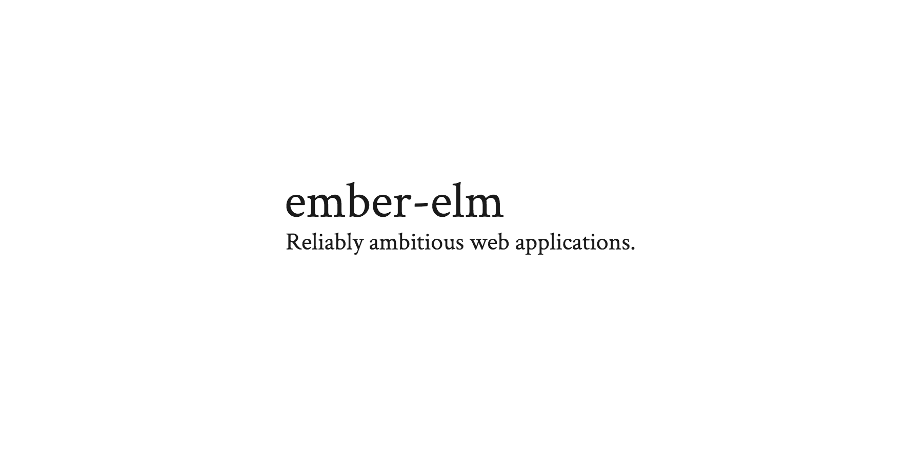

ember-elm lets you write Ember components in [Elm](http://elm-lang.org/)! It
integrates cleanly with your existing Ember application, so you can experiment
with Elm without having to migrate to another front-end stack. It also
integrates with ember-cli, so you can develop Elm code with the full power of
ember-cli's live reloading and addon ecosystem.

> ### [View the demo](https://nucleartide.github.io/ember-elm/)

## Features

- `elm-component` for using your Elm code in Ember
- ember-cli blueprint for Elm modules
- live-reload provided by ember-cli
- leverage the combined power of the ember-cli and Elm ecosystems together in
  one stack

## Setup

### Prerequisites

Before you can install ember-elm, you need to have two things installed:

1. **Node 6.0.0+ or up**. This is because this addon's [build code](index.js) uses
   ES6.
2. [**Elm**](https://guide.elm-lang.org/install.html). Don't worry, it's relatively
   pain-free! This will be automated in the future.

### Install

Then, to install:

```
ember install ember-elm
```

Alternatively, if you're using Yarn:

```
yarn add ember-elm --dev && ember g ember-elm
```

## Use

### Generate

To get started, let's get a simple "Hello World" example up and running.

First, generate an Elm module:

```
ember g elm-module hello
```

This will generate an Elm file in your project, located at
`app/elm-modules/Hello.elm`. You will see that a very basic Elm program has
already been written for you:

```elm
module Hello exposing (..)

import Html exposing (text)

main =
  text "hello world"
```

Take note of the `module Hello exposing (..)` declaration at the top of
`Hello.elm`. Like an ES6 file, every Elm file defines its own module. This
particular module will simply output a `<div>` containing the text "hello world"
to the screen.

### Componentize

Great! Your project now contains an Elm module. To actually use that module, you
should include `elm-modules` into your controller/component so you can use your
Elm module in a template. For example:

```js
import Ember from 'ember'
import Elm from 'app/elm-modules'

export default Ember.Component.extend({
  Elm,

  // rest of the component goes here...
})
```

Finally, in your template, you can invoke `elm-component`:

```hbs
{{elm-component src=Elm.Hello}}
```

(output goes here)

## API

## Notes

## Badges

---

Jason Tu
